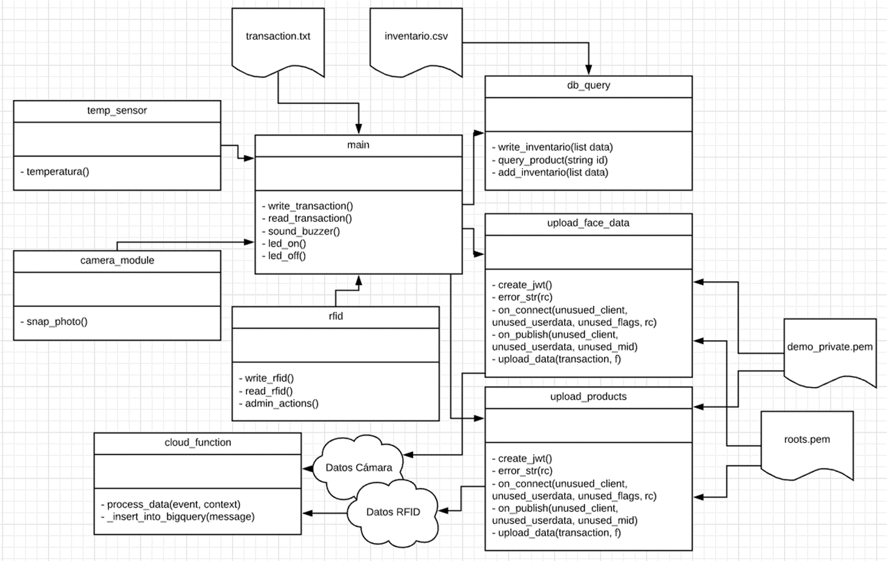
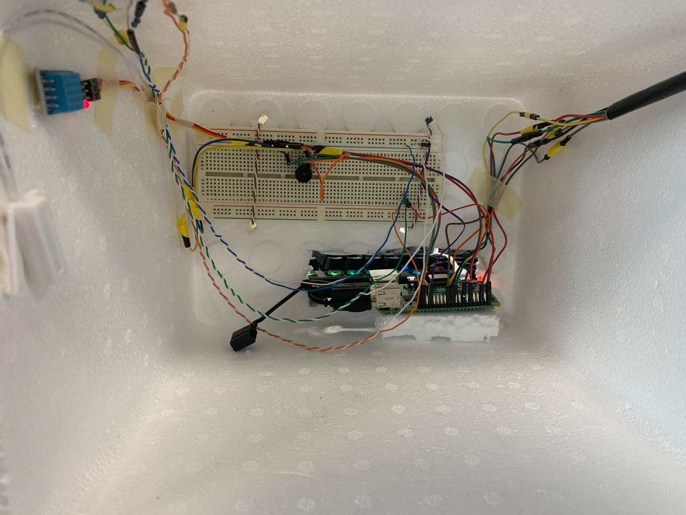
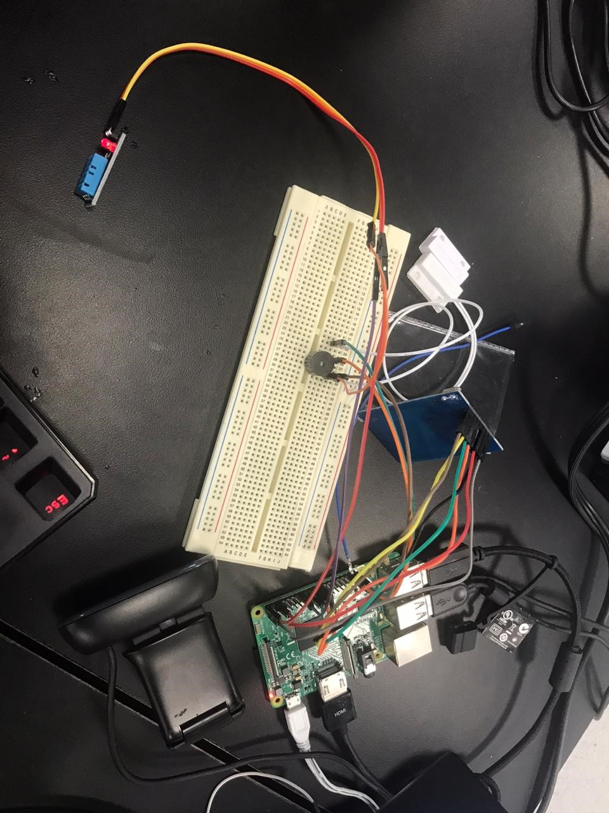
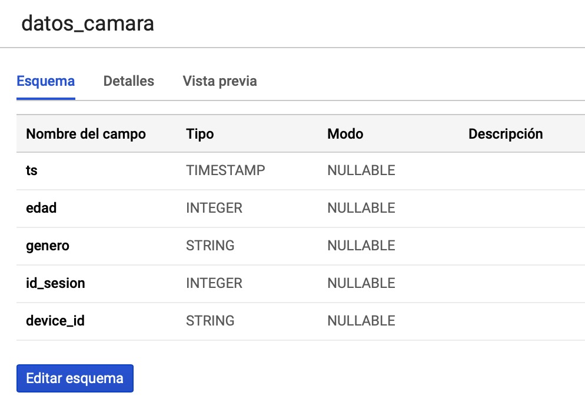
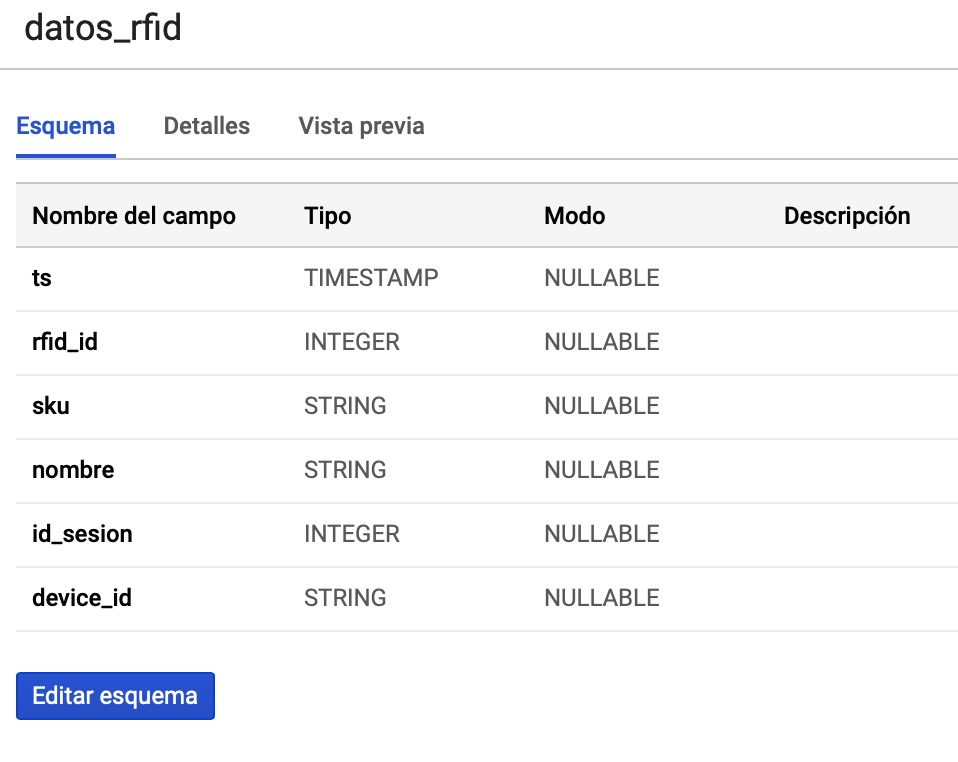

# IoT en el Supermercado
---
#### Equipo *Campus Santa Fridge*

##### Integrantes:
1. *Ruben Sanchez* - *A01021759* - *CSF*
2. *Martin Alegria* - *A01022216* - *CSF*
3. *Sebastián Gómez* - *A01374843* - *CSF*
4. *Carlos Garcia* - *A01025948* - *CSF*

---
## 1. Aspectos generales

### 1.1 Requerimientos técnicos

A continuación se mencionan los requerimientos técnicos mínimos del proyecto, favor de tenerlos presente para que cumpla con todos.

* Todo el código de la solución debe estar desarrollado en Python 3.7 utilizando módulos y Programación Orientada a Objetos.
* Las lecturas de los sensores debe programarse de manera asíncrona.
* Todo el código debe incluir el manejo de excepciones y validación de errores.
* El equipo tiene la libertad de elegir los servicios cognitivos y de nube que desee utilizar, sin embargo, debe tener presente que la solución final se deberá ejecutar en una Raspberry Pi y en una de las siguientes plataformas en la nube: [Amazon Web Services](https://aws.amazon.com/), [Google Cloud Platform](https://cloud.google.com/?hl=es) o [Microsoft Azure](https://azure.microsoft.com/es-mx/).
* El proyecto debe utilizar algunos de los servicios de reconocimiento de imágenes como: [Azure Computer Vision API](https://azure.microsoft.com/es-mx/services/cognitive-services/computer-vision/), [Google Vision AI](https://cloud.google.com/vision/), [Amazon Rekognition](https://aws.amazon.com/rekognition/).
* El proyecto debe utilizar algún servicio de IoT en la nube como: [Azure IoT Hub](https://azure.microsoft.com/es-mx/services/iot-hub/), [Google IoT Core](https://cloud.google.com/iot-core/?hl=es), [Amazon IoT Core](https://aws.amazon.com/es/iot-core/).
* Para la ingesta de datos, se debe utilizar un servicio de mensajería asíncrono como [Azure Service Bus](https://azure.microsoft.com/es-mx/services/service-bus/), [Google Cloud Pub/Sub](https://cloud.google.com/pubsub/?hl=es-419), [Amazon SNS](https://aws.amazon.com/sns/).
* Para el procesamiento de los paquetes de IoT se debe utilizar un servicio como [Azure Functions](https://azure.microsoft.com/es-mx/services/functions/), [Cloud Functions](https://cloud.google.com/functions/), [Amazon Lambda](https://aws.amazon.com/lambda/).
* Para el almacenamiento de la información se debe utilizar un servicio como [Azure SQL Datawarehouse](https://azure.microsoft.com/es-mx/services/sql-data-warehouse/), [Google BigQuery](https://cloud.google.com/bigquery/?hl=es), [Amazon Redshift](https://aws.amazon.com/es/redshift/).
Para la visualización de los datos se debe utilizar un servicio como [Azure Power BI](https://powerbi.microsoft.com/es-es/), [Google Data Studio](https://datastudio.google.com), [Amazon Quicksight](https://aws.amazon.com/quicksight/).
* La conexión entre la Raspberry Pi y el servicio de nube de IoT debe realizarse utilizando el protocolo MQTT y llaves criptográficas para la autenticación.
* La solución debe utilizar una arquitectura de microservicios. Si no tiene conocimiento sobre este tema, le recomendamos la lectura [*Microservices*](https://martinfowler.com/articles/microservices.html) de [Martin Fowler](https://martinfowler.com).
* La arquitectura debe ser modular, escalable, con redundancia y alta disponibilidad.
* La arquitectura deberá estar separada claramente por capas (*frontend*, *backend*, *API RESTful*, datos y almacenamiento).
* Los diferentes componentes del proyecto (*frontend*, *backend*, *API RESTful*, bases de datos, entre otros) pueden ejecutarse, opcionalmente, sobre contenedores [Docker](https://www.docker.com/) y utilizar [Kubernetes](https://kubernetes.io/) como orquestador.
* Todo el código, *datasets* y la documentación del proyecto debe alojarse en este repositorio de GitHub. Favor de mantener la estructura de carpetas generada.

### 1.2 Estructura del repositorio
El proyecto debe seguir la siguiente estructura de carpetas, la cual generamos por usted:
```
- / 			        # Raíz de todo el proyecto
    - README.md			# Archivo con los datos del proyecto (este archivo)
    - frontend			# Carpeta con la solución del frontend (Web app, dashboards, etc.)
    - backend			# Carpeta con la solución del backend (CMS, API, Funciones, etc.)
    - sensors           # Carpeta con los códigos que se ejecutan en el RPi
    - datasets		        # Carpeta con los datasets y recursos utilizados (csv, json, audio, videos, entre otros)
    - dbs			# Carpeta con los modelos, catálogos y scripts necesarios para generar las bases de datos
    - docs			# Carpeta con la documentación del proyecto
```

### 1.3 Documentación  del reto

Como parte de la entrega final del reto, se debe incluir la siguiente información:

* Justificación del modelo o servicio de *Machine Learning* que seleccionaron.
* Descripción del o los *datasets* y las fuentes de información utilizadas.
* Guía de configuración, instalación y despliegue de la solución tanto en la Raspberry Pi como en la plataforma en la nube seleccionada.
* El código debe estar documentado siguiendo los estándares definidos para el lenguaje de programación seleccionado.

## 2. Descripción del proyecto

*Solución de Internet of Things aplicada en un refrigerador. A través de sensores, una Raspberry PI, servicios cognitivos (Microsoft Azure) y servicios en la nube (Google Cloud Platform), un refrigerador puede tomar fotos de las personas que lo utilizan, analizar estas fotos para determinar el género y edad de la persona detectada, saber qué productos saca cada persona del refrigerador, subir esta información a la nube para que pueda ser analizada y puede reaccionar cuando su temperatura interna se sale de un cierto rango. La informacion obtenida (género, edad, hora y productos sacados) es analizada con el servicio en la nube para saber a qué horas y días ciertas personas compran ciertos productos del refrigerador. Con esta información, se pueden tomar decisiones en cuánto a cuándo poner promiciones y a qué productos, cuándo poner publicidad para qué producto, etc. La solución también permite llevar un mejor control del inventario.*

## 3. Solución

A continuación aparecen descritos los diferentes elementos que forman parte de la solución del proyecto.

### 3.1 Modelos o servicios de *Machine Learning* utilizados

*Para poder analizar las fotos tomadas con la cámara, se usaron los servicios de Microsoft Azure Cognitive Services. Este es un servicio que permite analizar fotos, encontrar caras y, en la cara más cercana que encuentra de las que están en la foto, determinar la edad, el género y el espacio, en la foto, en el que se encuentra la cara de la persona detectada. Nosotros decidimos usar Microsoft Azure Cognitive Services porque este nos permite saber la edad y el género de las personas que usan el refrigerador para así poder subir esta información a una base de datos, junto con la hora a la que se tomó la foto, y analizar el uso del refrigerador según la edad y el género.*

### 3.2 Arquitectura de la solución



Circuitos





### 3.3 Frontend

Desarrollamos distintos [queries](https://github.com/tec-csf/reto-iot-en-supermercado-2019-campus-santa-fridge/blob/master/backend/queries.sql) que nos sirvieron para después pasarlos a tablas independientes y poderlos convertir en un dashboard que presentara la información demanera concreta y fácil de interpretar para una mejor toma de decisiones.

#### 3.3.1 Lenguaje de programación

SQL

### 3.4 Backend

#### 3.4.1.1 Backend Raspberry y sensores

*Los archivos usados para controlar los sensores están en la carpeta de sensores. Estos son llamados desde el main.py y son: camera_module, rfid y temp_sensor.*

#### 3.4.1.2 Google Cloud Platform

*Se creó un registro llamado refrigerador con todos los dispositivos que utilizamos en el proyecto. Creamos dos dispositivos, el primero llamado cámara que hace referencia a los datos de entrada de Azure de edad y género y rfid que es aquel funciona cuando hay una lectura de este mismo sensor en el refrigerador. Generamos una tabla para cada dispositivo y le agregamos una columna con el título device_id para que con una [función de cloud](https://github.com/tec-csf/reto-iot-en-supermercado-2019-campus-santa-fridge/blob/master/backend/cloud_function.py) tuviéramos la capacidad de discernir entre estos y colocarlos en su respectiva tabla. Adicional a las de cada dispositivo creamos tablas nuevas a partir de los queries generados para poder generar un dashboard en Power BI.*

*Para subir la información capturada por los sensores a Google Cloud Platform, se usaron dos archivos: upload_face_data.py y upload_products.py. El archivo de upload_face_data obtiene los datos de la persona capturada y sube un timestamp, edad, género, el id de a sesión y el id del device a la tabla de datos cámara que está en la nube. El archivo de upload_products obtiene la información de cada producto que una persona en específico sacó del refrigerador y sube un timestamp, el rfid, el sku, nombre del producto, id de la sesión y el id del device a la tabla de datos RFID que está en la nube.*

#### 3.4.1.3 Base de Datos Local

*En las carpetas de datasets y db se encuentran dos archivos que son inventario.csv y transaction.txt. El archivo de transaction.txt sirve para llevar la cuenta de las transacciones y es llamado desde el main. El archivo inventario.csv tiene la información de los productos que pueden estar en el refrigerador. Desde el main, se llama a db_query.py el cual revisa el archivo de inventario para verificar que el sensor RFID haya detectado un producto que sí está entre nuestros productos. También sirve para manejar la cantidad disponible de cada producto en el refrigerador.*

#### 3.4.2 Lenguaje de programación

*Python 3.7*

#### 3.4.3 Librerías de funciones o dependencias

*Librerías Sensores*

- fswebcam
- GPIO
- SPI Py
- mfrc522
- Adafruit_DHT

*Referencias Senores*

- [Uso de la cámara](https://github.com/vcubells/iot_supermercado/tree/master/demo_03)
- [Uso de sensor magnético](https://www.alexisabarca.com/2016/01/usar-un-sensor-de-puerta-magnetico-en-un-raspberry-pi/)
- [Sensor RFID](https://medium.com/coinmonks/for-beginners-how-to-set-up-a-raspberry-pi-rfid-rc522-reader-and-record-data-on-iota-865f67843a2d)
- [Sensor de Temperatura](https://github.com/adafruit/Adafruit_Python_DHT)

### 3.5 Sensores

*En nuestra solución, utilizamos los siguientes sensores: sensor magnético, sensor RFID RC522 y el sensor DHT11 (temperatura y humedad). Además utilizamos una cámara Logitech HD Webcam y un buzzer.*

*Para capturar las caras de las personas que usan el refrigerador, hicimos el programa de tal forma que la cámara toma una foto cuando el sensor magnético detecta que sus componentes han sido separados (es decir, la puerta se abrió). La cámara está conectada directamente a la Raspberry, mientras que el sensor magnético está conectado a un protoboard que a su vez esta conectado a la Raspberry en los pines correspondientes (datos y tierra). Si la puerta es cerrada y después se vuelve a abrir, entonces se toma otra foto. En el main, se detecta si la puerta se abrió y entonces se llama a una función (que está en otro archivo) para tomar la foto.*

*Para medir la temperatura usamos, el sensor DHT11. Este es llamado constantemente en el main, si la temperatura sube de un cierto valor, un buzzer emite un sonido de alarma.*

*El sensor RFID RC522 es usado para determinar si un producto sale del refrigerador y cuál fue el producto que salió. El sensor lee constantemente si el refrigerador esta abierto a través de una función que está en un archivo diferente del main. Cada vez que pasa un producto por el RFID, el buzzer omite un sonido y unos LEDs se prenden después de que se acabó de escanear el RFID. Entonces, el buzzer empieza emitir sonidos. Mientras se emiten los sonidos, se puede cerrar la puerta. Si no, el sensor RFID va a seguir leyendo. Si se quiere cerrar la puerta afuera de los segundos durante los que se emiten sonidos,  entonces se debe de utilizar el tag negro de administrador.*

#### 3.5.1 Lenguaje de programación

*Python 3.7*

#### 3.5.2 Librerías de funciones o dependencias

*Librerías*

- fswebcam
- GPIO
- SPI Py
- mfrc522
- Adafruit_DHT

*Referencias*

- [Uso de la cámara](https://github.com/vcubells/iot_supermercado/tree/master/demo_03)
- [Uso de sensor magnético](https://www.alexisabarca.com/2016/01/usar-un-sensor-de-puerta-magnetico-en-un-raspberry-pi/)
- [Sensor RFID](https://medium.com/coinmonks/for-beginners-how-to-set-up-a-raspberry-pi-rfid-rc522-reader-and-record-data-on-iota-865f67843a2d)
- [Sensor de Temperatura](https://github.com/adafruit/Adafruit_Python_DHT)

## 3.6 Pasos a seguir para utilizar el proyecto

*[Incluya aquí una guía paso a paso para poder utilizar el proyecto, desde la clonación de este repositorio hasta el despliegue de la solución en una Raspberry Pi y en una plataforma en la nube.]*

1. [Preparar Raspberry Pi](https://github.com/vcubells/iot_supermercado/tree/master/demo_01)
2. Clonar repositorio en la Raspberry Pi.
3. Conectar corriente a Raspberry Pi y conectar entrada para que se pueda ver en un monitor.
4. Instalar git, python 3.7, pip, wget y tener conexión a Internet.
5. Cambiar la hora en la Raspberry Pi.
6. Conectar cámara a Raspberry Pi.
7. [Seguir instrucciones para crear entorno local y cuenta de Google Cloud.](https://github.com/vcubells/iot_supermercado/tree/master/demo_05)
8. [Seguir tutorial para instalar librerías necesarias para el sensor RFID.](https://medium.com/coinmonks/for-beginners-how-to-set-up-a-raspberry-pi-rfid-rc522-reader-and-record-data-on-iota-865f67843a2d)
9. [Seguir tutorial para instalar librerías necesarias para el sensor DHT_11](https://github.com/adafruit/Adafruit_Python_DHT)
*La carpeta de Adafruit_DHT debe de estar en la carpeta de sensores.*
10. [Para conectar sensor RFID a la Raspberry, favor de seguir instrucciones en el tutorial.](https://medium.com/coinmonks/for-beginners-how-to-set-up-a-raspberry-pi-rfid-rc522-reader-and-record-data-on-iota-865f67843a2d)
11. Para conectar el sensor magnético, utilizar el pin 40 del board.
12. Para conectar el buzzer, utilizar el pin 38.
13. Para los LEDs, utilizar el pin 12.
14. Para conectar el sensor de temperatura, utilizar el pin 23.
15. Armar refrigerador al gusto.
16. Usar inventario.txt para registrar productos que se quieran usar. Ejemplo en el repositorio, orden debe ser: id_tag, sku, nombre de producto y cantidad.
17. Usar programa rfid.py para escribir ids en los tags que se quieran usar.

#### Preparación de Google Platform
18. Antes de comenzar, revisar [este](https://github.com/vcubells/iot_supermercado/tree/master/demo_05) link y [este otro](https://github.com/vcubells/iot_supermercado/tree/master/demo_06) link para conocer el proceso.
19. Ir a IoT Core y crear un proyecto llamado "santa-fridge".
20. Crear un registro llamado "refrigerador" y los "camara" y "rfid" y asignar las llaves públicas de los dispositivos a utilizar.
21. Ir a Pub/Sub a la subsección de "Suscripciones" y crear una de tipo pull.
22. Seleccionar en el menú "Cloud Functions" y crear una tomando como base [la que se encuentra en el repositorio](https://github.com/tec-csf/reto-iot-en-supermercado-2019-campus-santa-fridge/blob/master/backend/cloud_function.py) y seleccionar Pub/Sub como el activador.
23. Generar dos tablas con la siguiente configuración:





24. Hacer los queries ([sugerencias](https://github.com/tec-csf/reto-iot-en-supermercado-2019-campus-santa-fridge/blob/master/backend/queries.sql)) deseados y seleccionar "Guardar Datos como Tabla de BigQuery".
25. Sobre estas tablas realizar los dashboards deseados.

#### Cómo usar el refrigerador

1. Cerrar refrigerador y correr main.
2. Abrir puerta y posar para la cámara.
3. Escoger producto y pasar tag por en frente de sensor RFID.
4. Esperar 4 segundos para poder escanear otro producto.
*Durante estos 4 segundos, puede cerrar la puerta. Si no se cierra la puerta durante estos segundos, usar tag negro incluido para cerrar puerta.*

## 4. Referencias

*[Incluya aquí las referencias a sitios de interés, datasets y cualquier otra información que haya utilizado para realizar el proyecto y que le puedan ser de utilidad a otras personas que quieran usarlo como referencia]*
